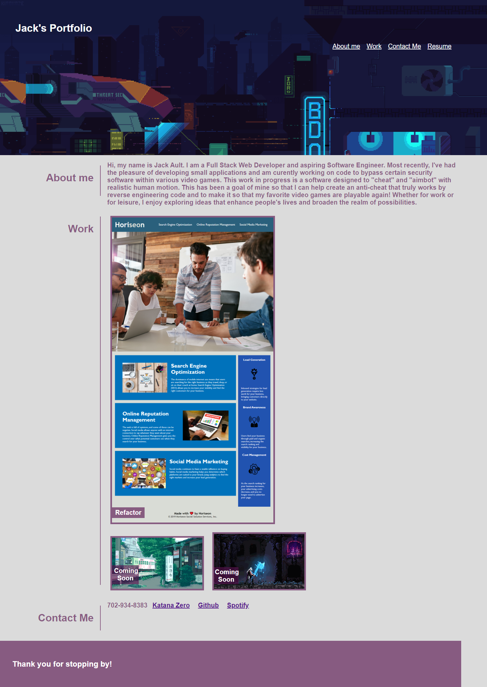

# My Portfolio
## Description
- The goal of this Portfolio was to create an aesthetically pleasing and working site so potential employers and/or colleagues could view my work.
- This portfolio is my attempt to showcase my skills and work with simple css and html stylings only.
- Creating this portfolio page has vastly increased my knowledge regarding the differences and possibilities available to me by simply utilizing raw HTML and CSS codes.

## Usage
- Github repo is viewable here: https://github.com/henlowgg/my-super-special-portfolio
- Site is viewable at: https://henlowgg.github.io/my-super-special-portfolio/
- Preview: 
## Credits
- Leif E. Hetland for helping me to understand better the functionality of flex boxes.
- Katana Zero for utilizing a link to their video game as it is an inspo for me to create something like it one day.
- Spotify for utilizing a playlist as a website placeholder for the meantime.
- https://coding-boot-camp.github.io/full-stack/github/professional-readme-guide for the README layout.
- https://choosealicense.com/licenses/mit/ for the copyright layout.
## License
- 

Copyright (c) [2021] [Jack Ault]

Permission is hereby granted, free of charge, to any person obtaining a copy
of this software and associated documentation files (the "Software"), to deal in the Software without restriction, including without limitation the rights to use, copy, modify, merge, publish, distribute, sublicense, and/or sell copies of the Software, and to permit persons to whom the Software is
furnished to do so, subject to the following conditions:

The above copyright notice and this permission notice shall be included in all copies or substantial portions of the Software.

THE SOFTWARE IS PROVIDED "AS IS", WITHOUT WARRANTY OF ANY KIND, EXPRESS OR
IMPLIED, INCLUDING BUT NOT LIMITED TO THE WARRANTIES OF MERCHANTABILITY,
FITNESS FOR A PARTICULAR PURPOSE AND NONINFRINGEMENT. IN NO EVENT SHALL THE
AUTHORS OR COPYRIGHT HOLDERS BE LIABLE FOR ANY CLAIM, DAMAGES OR OTHER
LIABILITY, WHETHER IN AN ACTION OF CONTRACT, TORT OR OTHERWISE, ARISING FROM, OUT OF OR IN CONNECTION WITH THE SOFTWARE OR THE USE OR OTHER DEALINGS IN THE SOFTWARE.